- [Arquitetura Completa de E‑commerce](#arquitetura-completa-de-ecommerce)
  - [Baseada em Microservices + Event‑Driven Architecture](#baseada-em-microservices--eventdriven-architecture)
- [1. Visão Geral da Arquitetura](#1-visão-geral-da-arquitetura)
- [2. Domínios de Negócio](#2-domínios-de-negócio)
- [3. Arquitetura de Microsserviços](#3-arquitetura-de-microsserviços)
- [4. Fluxo Completo de Compra](#4-fluxo-completo-de-compra)
- [5. Event Driven Architecture](#5-event-driven-architecture)
- [6. Saga Pattern](#6-saga-pattern)
- [7. CQRS](#7-cqrs)
- [8. Event Sourcing](#8-event-sourcing)
- [9. Arquitetura de Busca](#9-arquitetura-de-busca)
- [10. Sistema de Cache](#10-sistema-de-cache)
- [11. Observabilidade](#11-observabilidade)
- [12. Arquitetura Kubernetes](#12-arquitetura-kubernetes)
- [13. Pipeline CI/CD](#13-pipeline-cicd)
- [14. Segurança](#14-segurança)
- [15. Escalabilidade](#15-escalabilidade)
- [16. Benefícios da Arquitetura](#16-benefícios-da-arquitetura)
- [Conclusão](#conclusão)

# Arquitetura Completa de E‑commerce
## Baseada em Microservices + Event‑Driven Architecture

Este documento apresenta uma **arquitetura completa de e‑commerce** baseada nos conceitos do estudo de:

- Microservices Architecture
- Event‑Driven Architecture
- Saga Pattern
- CQRS
- Event Sourcing
- Cloud‑Native Infrastructure

Stack sugerida:

- Java + Spring Boot
- Apache Kafka
- PostgreSQL
- Redis
- Elasticsearch
- Docker
- Kubernetes
- OpenTelemetry + Prometheus + Grafana

---

# 1. Visão Geral da Arquitetura

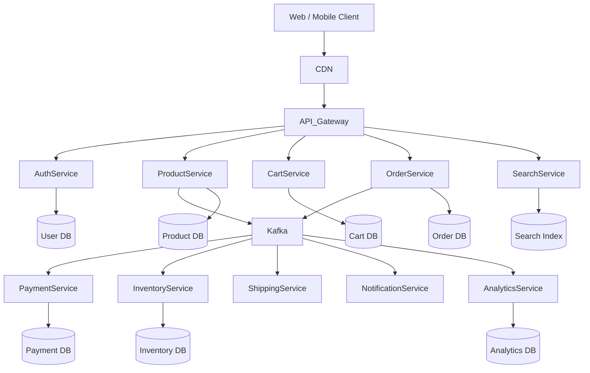

---

# 2. Domínios de Negócio

Arquitetura baseada em **Domain Driven Design**.

| Domínio | Microsserviço |
|------|---------------|
Identidade | Auth Service |
Catálogo | Product Service |
Busca | Search Service |
Carrinho | Cart Service |
Pedidos | Order Service |
Pagamentos | Payment Service |
Estoque | Inventory Service |
Envio | Shipping Service |
Notificação | Notification Service |
Analytics | Analytics Service |

---

# 3. Arquitetura de Microsserviços

Cada serviço possui:

- responsabilidade única
- banco próprio
- deploy independente
- comunicação por API ou eventos

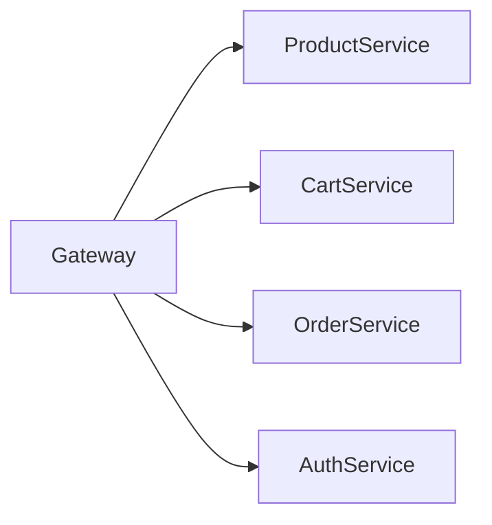

---

# 4. Fluxo Completo de Compra

Fluxo principal de e‑commerce.

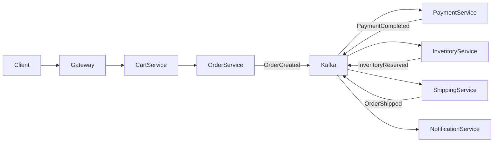

---

# 5. Event Driven Architecture

Eventos principais do sistema.

| Evento | Producer | Consumers |
|------|----------|-----------|
OrderCreated | Order Service | Payment, Inventory |
PaymentCompleted | Payment Service | Shipping |
InventoryReserved | Inventory Service | Shipping |
OrderShipped | Shipping Service | Notification |
ProductUpdated | Product Service | Search |
UserRegistered | Auth Service | Notification |

---

# 6. Saga Pattern

Gerencia transações distribuídas.

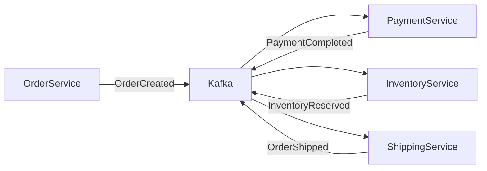

---

# 7. CQRS

Separação entre escrita e leitura.

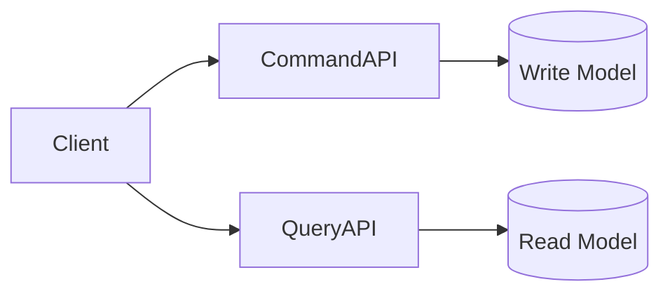

Uso comum:

- consultas rápidas de pedidos
- dashboards
- relatórios

---

# 8. Event Sourcing

Eventos representam a verdade do sistema.

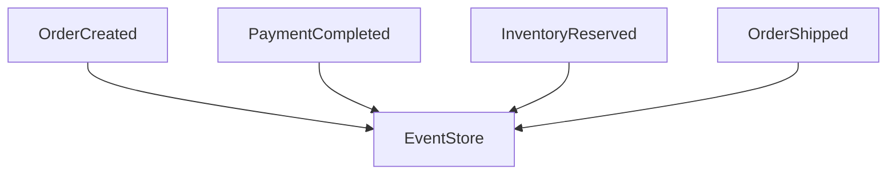

Benefícios:

- auditoria completa
- reconstrução de estado
- histórico do sistema

---

# 9. Arquitetura de Busca

Busca escalável usando Elasticsearch.

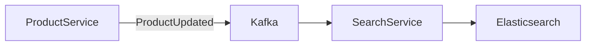

---

# 10. Sistema de Cache

Redis usado para:

- sessões
- carrinho
- cache de produtos

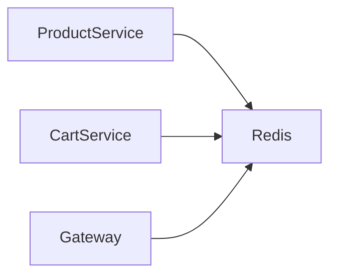

---

# 11. Observabilidade

Arquitetura observável.

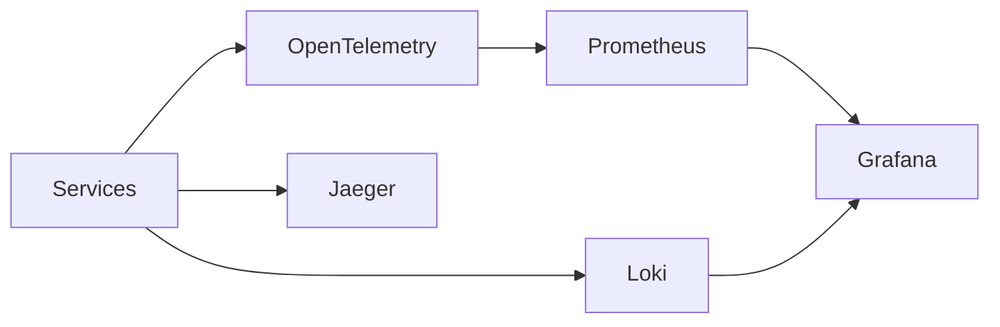

---

# 12. Arquitetura Kubernetes

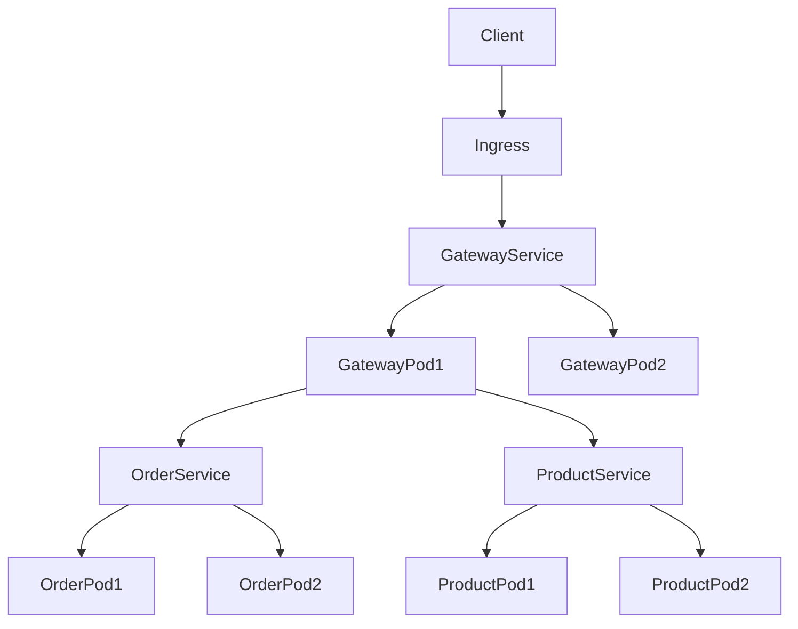

Componentes principais:

| Recurso | Função |
|-------|-------|
Pod | container executando serviço |
Service | load balancing interno |
Ingress | entrada HTTP |
Deployment | gerenciar replicas |
ConfigMap | configurações |
Secret | credenciais |

---

# 13. Pipeline CI/CD

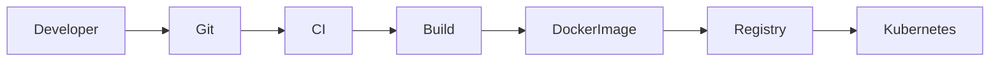

Ferramentas:

- GitHub Actions
- GitLab CI
- Jenkins
- ArgoCD

---

# 14. Segurança

Principais mecanismos:

- OAuth2
- JWT
- mTLS entre serviços
- RBAC Kubernetes
- Secret Manager

---

# 15. Escalabilidade

Escala horizontal.

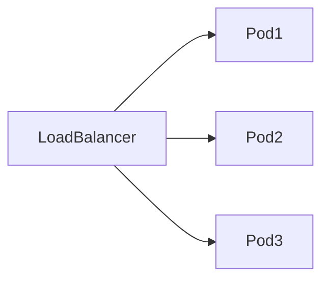

Kubernetes utiliza:

- Horizontal Pod Autoscaler
- Cluster Autoscaler

---

# 16. Benefícios da Arquitetura

- alta escalabilidade
- desacoplamento
- deploy independente
- resiliência
- evolução rápida

---

# Conclusão

Esta arquitetura representa um **modelo moderno de plataforma de e‑commerce baseada em microsserviços e eventos**.

Ela permite:

- crescimento horizontal
- times independentes
- evolução contínua
- observabilidade completa
