- [Arquitetura de Referência — Java + Spring Boot + Kafka + Kubernetes](#arquitetura-de-referência--java--spring-boot--kafka--kubernetes)
- [1. Visão Geral da Arquitetura](#1-visão-geral-da-arquitetura)
  - 
- [2. Componentes Principais](#2-componentes-principais)
  - [API Gateway](#api-gateway)
- [3. Microsserviços](#3-microsserviços)
- [4. Arquitetura de Comunicação](#4-arquitetura-de-comunicação)
  - [Comunicação síncrona](#comunicação-síncrona)
  - [Comunicação assíncrona](#comunicação-assíncrona)
- [5. Event Driven Architecture](#5-event-driven-architecture)
- [6. Saga Pattern](#6-saga-pattern)
  - [Coreografia](#coreografia)
  - [Orquestração](#orquestração)
- [7. Database per Service](#7-database-per-service)
- [8. Arquitetura Kubernetes](#8-arquitetura-kubernetes)
- [9. Observabilidade](#9-observabilidade)
- [10. Pipeline CI/CD](#10-pipeline-cicd)
- [11. Segurança](#11-segurança)
- [12. Escalabilidade](#12-escalabilidade)
- [13. Padrões Utilizados](#13-padrões-utilizados)
- [14. Benefícios da Arquitetura](#14-benefícios-da-arquitetura)
- [15. Tecnologias Recomendadas](#15-tecnologias-recomendadas)
- [Conclusão](#conclusão)

# Arquitetura de Referência — Java + Spring Boot + Kafka + Kubernetes

Este documento descreve uma **arquitetura moderna de microsserviços orientada a eventos**, utilizando:

- Java
- Spring Boot
- Apache Kafka
- Kubernetes
- PostgreSQL
- Observabilidade com OpenTelemetry + Prometheus + Grafana

Objetivo:
- Alta escalabilidade
- Baixo acoplamento
- Deploy independente
- Resiliência
- Observabilidade completa

---

# 1. Visão Geral da Arquitetura

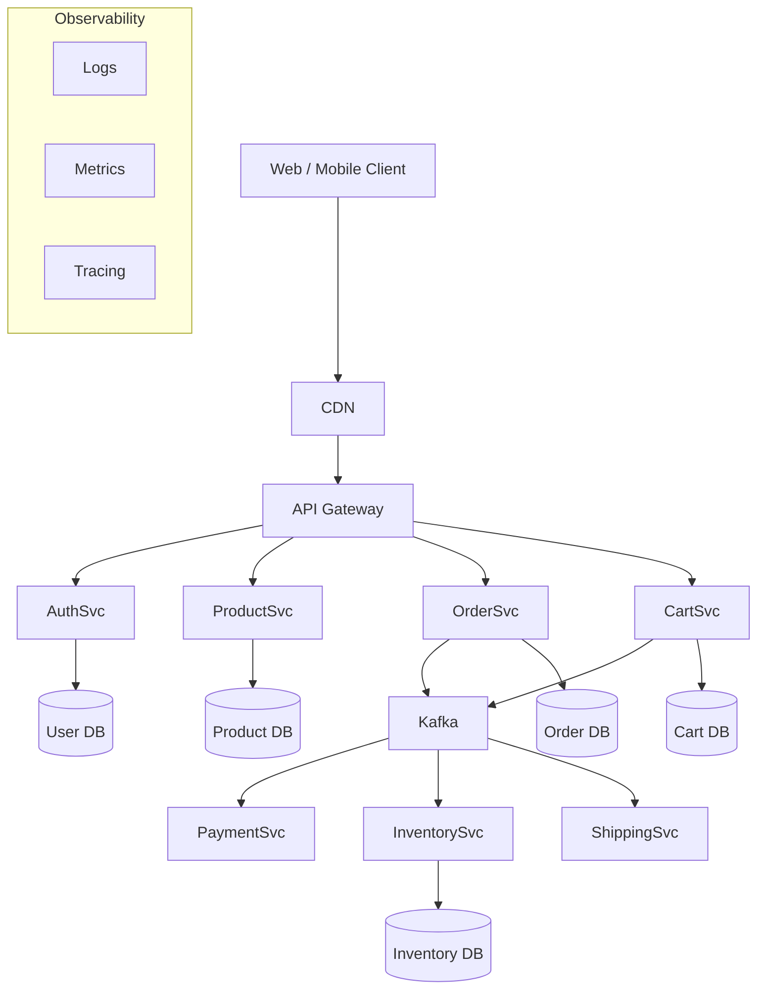
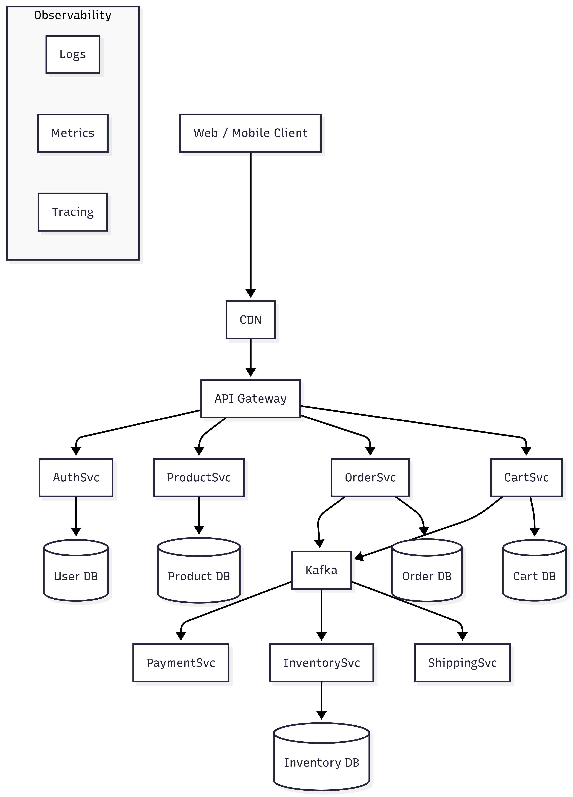
---

# 2. Componentes Principais

## API Gateway

Responsabilidades:

- autenticação
- roteamento
- rate limiting
- agregação de APIs

Tecnologias comuns:

- Spring Cloud Gateway
- Kong
- NGINX

---

# 3. Microsserviços

Cada serviço:

- possui banco próprio
- possui deploy independente
- comunica via REST ou eventos

Exemplo de serviços:

| Serviço | Responsabilidade |
|------|----------------|
| Auth Service | autenticação |
| Product Service | catálogo |
| Order Service | pedidos |
| Cart Service | carrinho |
| Payment Service | pagamentos |
| Inventory Service | estoque |
| Shipping Service | envio |

---

# 4. Arquitetura de Comunicação

## Comunicação síncrona

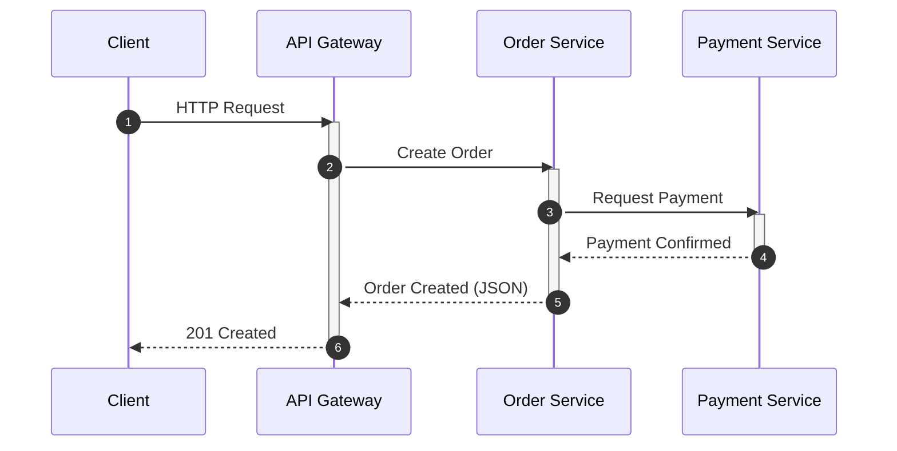
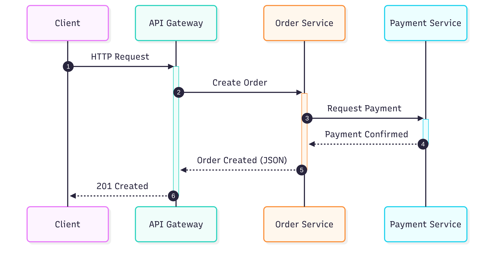

Problemas:

- latência
- acoplamento

---

## Comunicação assíncrona

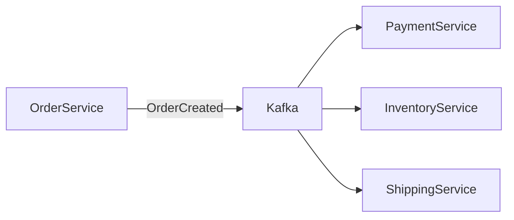
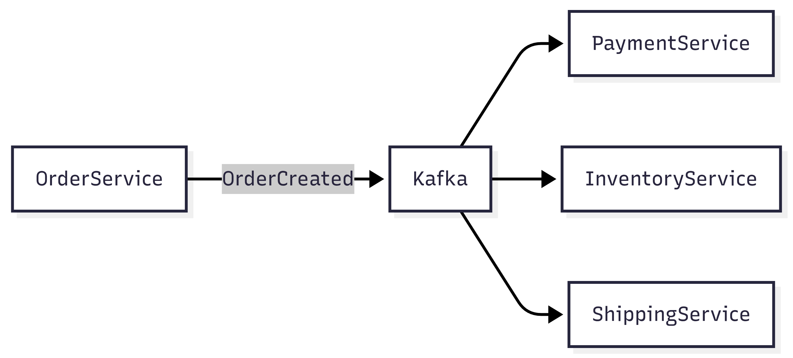

Benefícios:

- desacoplamento
- escalabilidade
- tolerância a falhas

---

# 5. Event Driven Architecture

Eventos principais:

| Evento | Producer | Consumers |
|------|----------|-----------|
| OrderCreated | Order Service | Payment, Inventory |
| PaymentCompleted | Payment Service | Shipping |
| ProductUpdated | Product Service | Search |
| InventoryUpdated | Inventory Service | Order |

---

# 6. Saga Pattern

Gerencia transações distribuídas.

## Coreografia

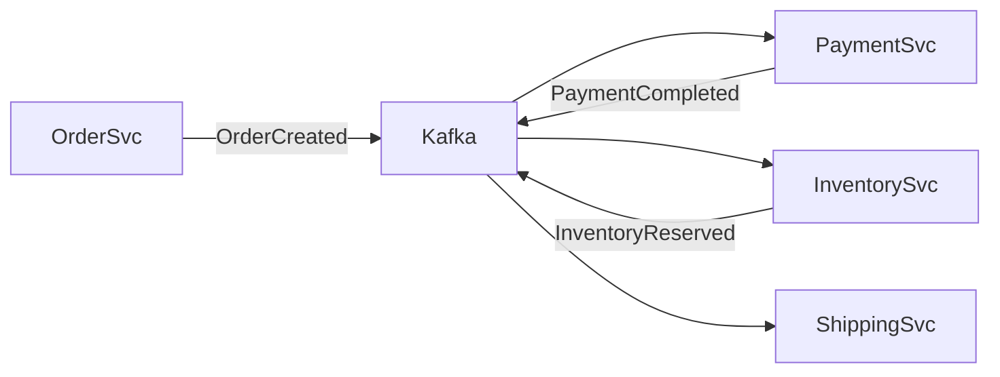

## Orquestração

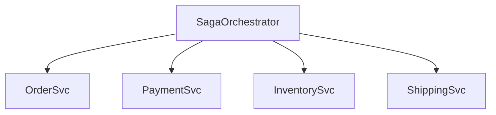
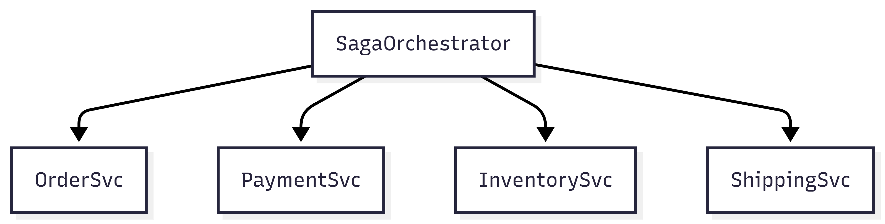

---

# 7. Database per Service

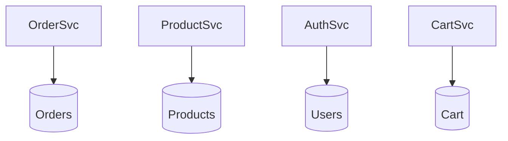
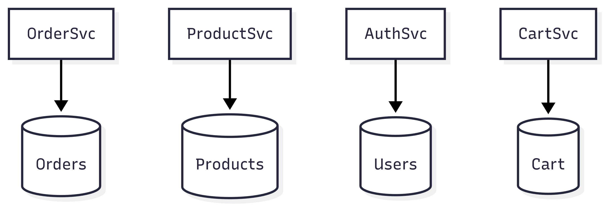

Regra:

**um serviço nunca acessa banco de outro serviço.**

---

# 8. Arquitetura Kubernetes

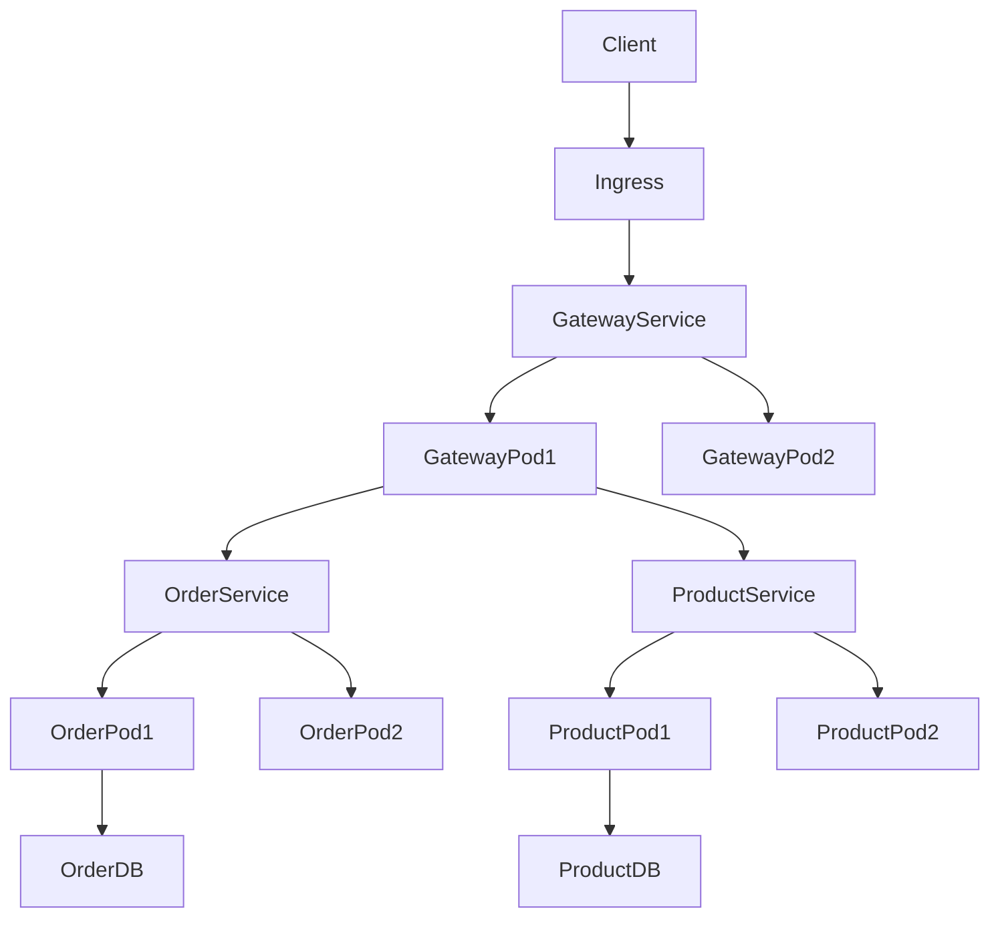
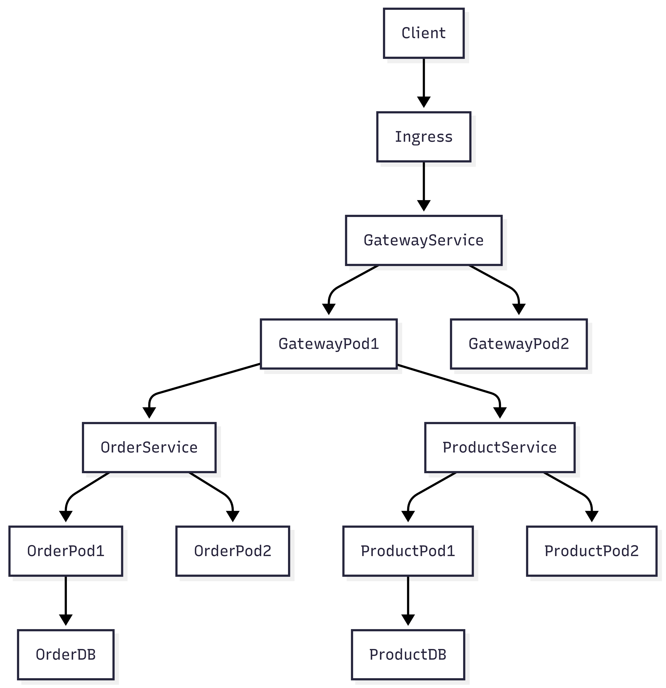

Componentes Kubernetes:

| Componente | Função |
|---------|------|
| Pod | container executando serviço |
| Service | load balancing interno |
| Ingress | entrada HTTP |
| Deployment | gerenciar réplicas |
| ConfigMap | configuração |
| Secret | credenciais |

---

# 9. Observabilidade

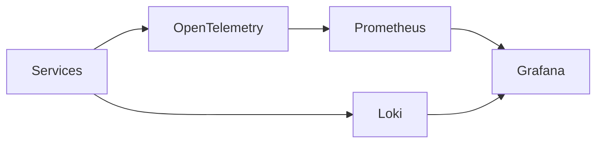
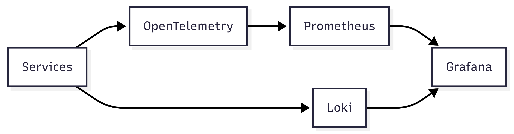

Stack recomendada:

| Tipo | Ferramenta |
|----|-------------|
| Logs | Loki / ELK |
| Metrics | Prometheus |
| Tracing | Jaeger |
| Instrumentação | OpenTelemetry |

---

# 10. Pipeline CI/CD

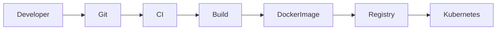
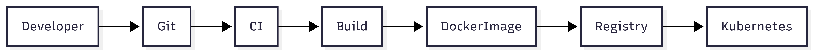

Ferramentas comuns:

- GitHub Actions
- GitLab CI
- Jenkins
- ArgoCD

---

# 11. Segurança

Principais mecanismos:

- OAuth2
- JWT
- mTLS entre serviços
- RBAC no Kubernetes
- Secrets Manager

---

# 12. Escalabilidade

Escala horizontal:

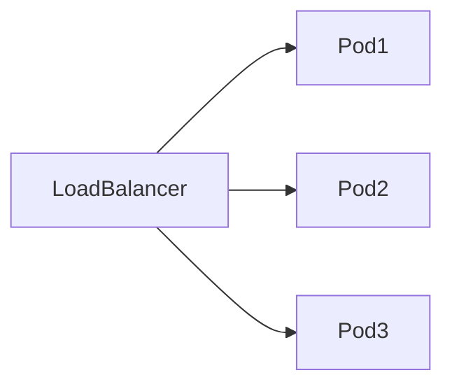
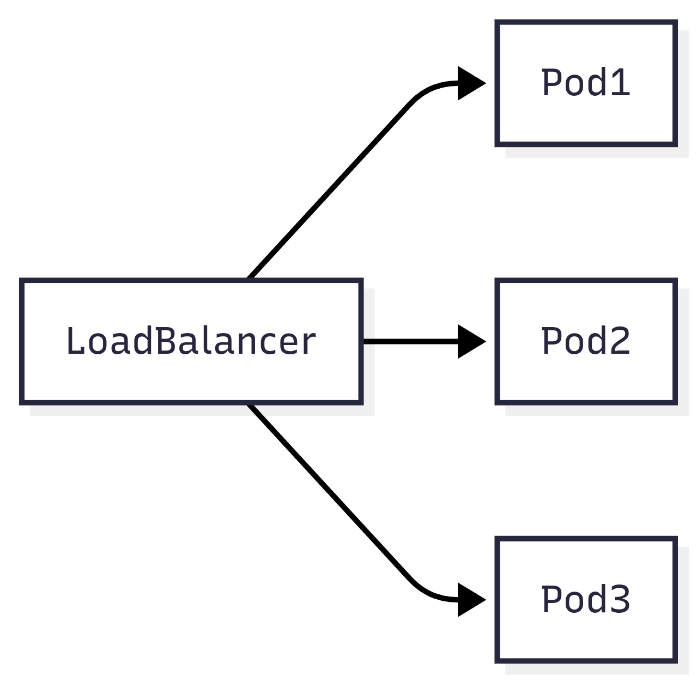

Kubernetes usa:

- Horizontal Pod Autoscaler
- Cluster Autoscaler

---

# 13. Padrões Utilizados

Arquitetura usa:

- Microservices
- Event Driven Architecture
- Saga Pattern
- CQRS (opcional)
- Event Sourcing (opcional)
- Database per Service

---

# 14. Benefícios da Arquitetura

- alta escalabilidade
- deploy independente
- resiliência
- desacoplamento
- observabilidade completa

---

# 15. Tecnologias Recomendadas

| Camada | Tecnologia |
|------|-------------|
| Language | Java |
| Framework | Spring Boot |
| Messaging | Kafka |
| Database | PostgreSQL |
| Container | Docker |
| Orchestration | Kubernetes |
| Observability | OpenTelemetry |
| Metrics | Prometheus |
| Dashboard | Grafana |
| CI/CD | GitHub Actions / ArgoCD |

---

# Conclusão

Esta arquitetura representa o **modelo mais comum usado em plataformas modernas de alta escala**, como:

- Netflix
- Uber
- Amazon
- Spotify

Ela combina:

- Microsserviços
- Event Driven Architecture
- Cloud Native Infrastructure
