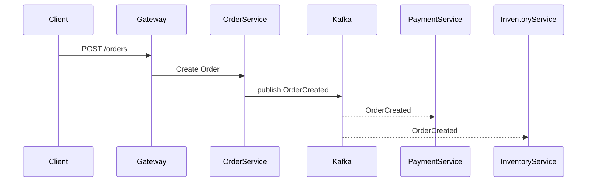
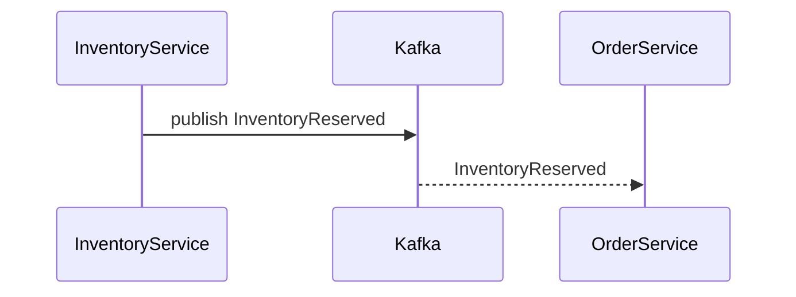
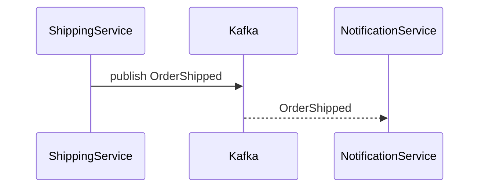
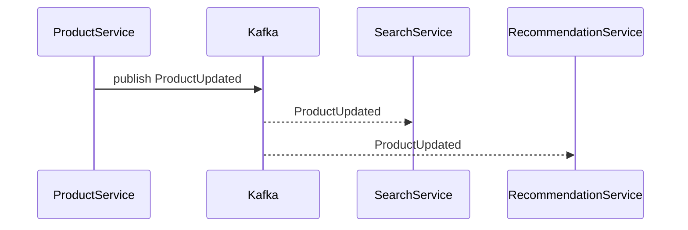
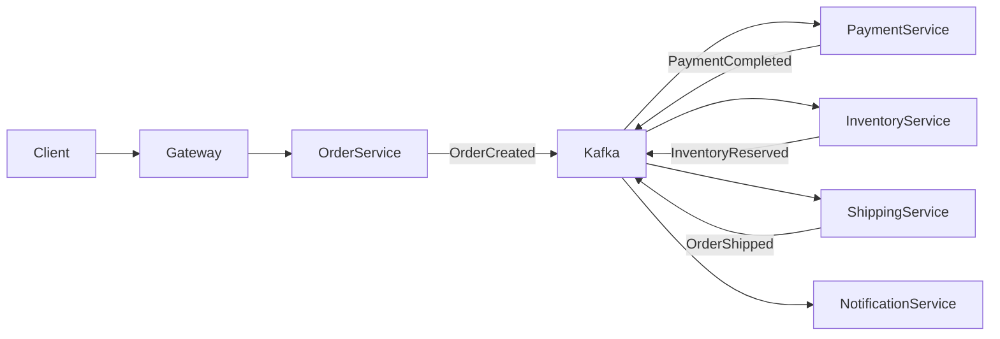
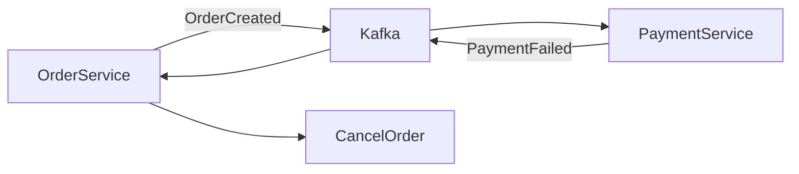
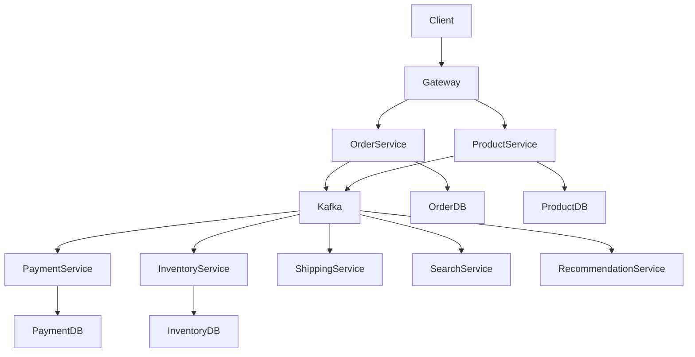

- [Fluxos Reais de Microsserviços Orientados a Eventos](#fluxos-reais-de-microsserviços-orientados-a-eventos)
- [1. Fluxo de Criação de Pedido (Order Flow)](#1-fluxo-de-criação-de-pedido-order-flow)
- [2. Fluxo de Pagamento](#2-fluxo-de-pagamento)
- [3. Fluxo de Estoque](#3-fluxo-de-estoque)
- [4. Fluxo de Envio (Shipping Flow)](#4-fluxo-de-envio-shipping-flow)
- [5. Fluxo de Atualização de Produto](#5-fluxo-de-atualização-de-produto)
- [6. Fluxo Completo de Saga Distribuída](#6-fluxo-completo-de-saga-distribuída)
- [7. Fluxo de Falha (Compensação Saga)](#7-fluxo-de-falha-compensação-saga)
- [8. Estrutura de Eventos Kafka](#8-estrutura-de-eventos-kafka)
- [9. Boas Práticas em Event Driven](#9-boas-práticas-em-event-driven)
    - [Idempotência](#idempotência)
    - [Event Versioning](#event-versioning)
    - [Event Schema](#event-schema)
    - [Retry e Dead Letter Queue](#retry-e-dead-letter-queue)
- [10. Arquitetura Completa](#10-arquitetura-completa)
- [Conclusão](#conclusão)


# Fluxos Reais de Microsserviços Orientados a Eventos

Este documento mostra **fluxos reais de sistemas distribuídos usando Event‑Driven Architecture**.
Os exemplos são baseados em arquiteturas comuns usadas em **Java + Spring Boot + Kafka + Kubernetes**.

Fluxos incluídos:

1. Fluxo de criação de pedido (Order Flow)
2. Fluxo de pagamento (Payment Flow)
3. Fluxo de atualização de estoque (Inventory Flow)
4. Fluxo de envio (Shipping Flow)
5. Fluxo de atualização de catálogo (Product Update Flow)
6. Fluxo completo de Saga distribuída

---

# 1. Fluxo de Criação de Pedido (Order Flow)

Quando um cliente cria um pedido.



Eventos produzidos:

| Evento | Producer |
|------|----------|
OrderCreated | Order Service |

Consumidores:

- Payment Service
- Inventory Service

---

# 2. Fluxo de Pagamento

Pagamento é processado após criação do pedido.


Eventos:

| Evento | Producer |
|------|-----------|
PaymentCompleted | Payment Service |

Consumidores:

- Order Service
- Shipping Service

---

# 3. Fluxo de Estoque

Após pagamento aprovado, estoque é reservado.



Eventos:

| Evento | Producer |
|------|-----------|
InventoryReserved | Inventory Service |

Consumidores:

- Order Service

---

# 4. Fluxo de Envio (Shipping Flow)

Quando pagamento e estoque são confirmados.



Eventos:

| Evento | Producer |
|------|-----------|
OrderShipped | Shipping Service |

Consumidores:

- Notification Service

---

# 5. Fluxo de Atualização de Produto

Quando um produto é atualizado.



Consumidores:

- Search Service
- Recommendation Service

---

# 6. Fluxo Completo de Saga Distribuída

Fluxo completo de um pedido usando **Saga Coreografada**.



Sequência de eventos:

1. OrderCreated
2. PaymentCompleted
3. InventoryReserved
4. OrderShipped

---

# 7. Fluxo de Falha (Compensação Saga)

Se pagamento falhar.



Evento compensatório:

| Evento | Ação |
|------|------|
PaymentFailed | cancelar pedido |

---

# 8. Estrutura de Eventos Kafka

Exemplo de evento JSON.

```json
{
  "eventId": "12345",
  "eventType": "OrderCreated",
  "timestamp": "2026-03-16T12:00:00Z",
  "data": {
    "orderId": "987",
    "customerId": "456",
    "total": 150.00
  }
}
```

Campos recomendados:

- eventId
- eventType
- timestamp
- payload

---

# 9. Boas Práticas em Event Driven

### Idempotência

Consumidores devem aceitar duplicação de eventos.

### Event Versioning

Nunca quebrar contratos de eventos.

### Event Schema

Usar:

- Avro
- Protobuf
- JSON Schema

### Retry e Dead Letter Queue

Kafka DLQ para eventos falhos.

---

# 10. Arquitetura Completa



---

# Conclusão

Arquiteturas orientadas a eventos permitem:

- baixo acoplamento
- alta escalabilidade
- resiliência
- processamento assíncrono

Esse modelo é amplamente usado em plataformas modernas como:

- Netflix
- Uber
- Amazon
- Spotify
