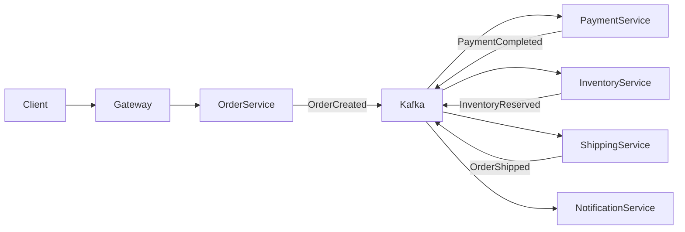
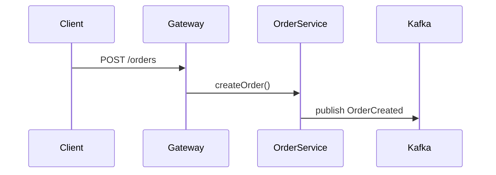
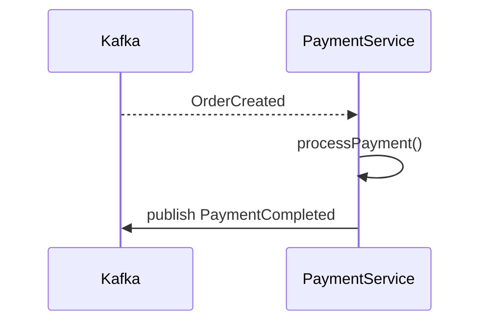
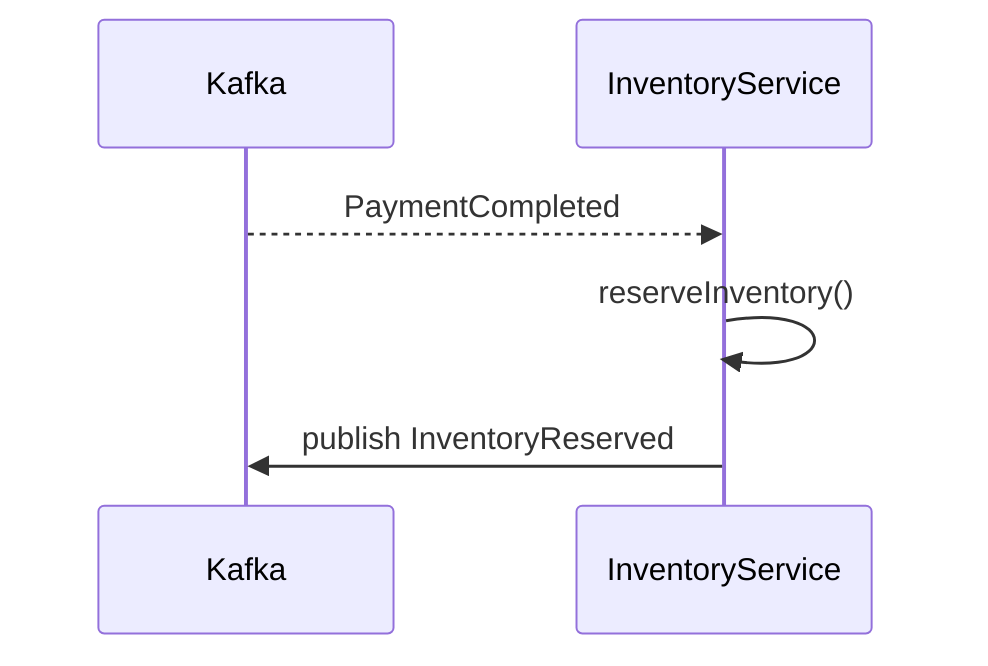
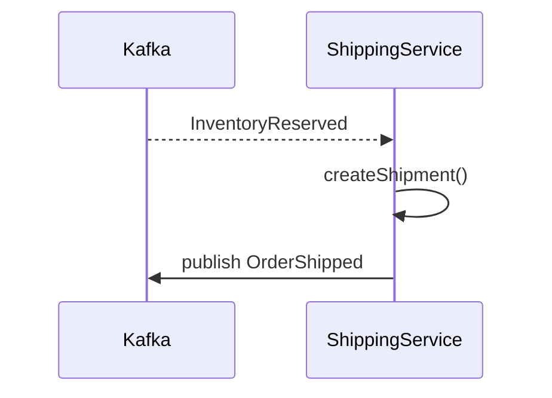
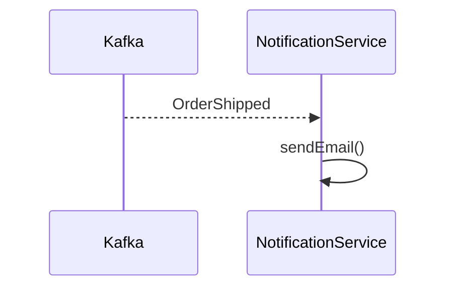
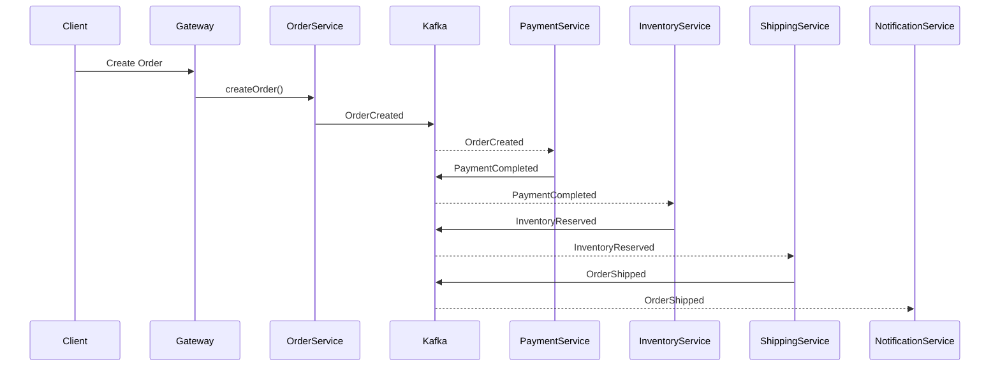
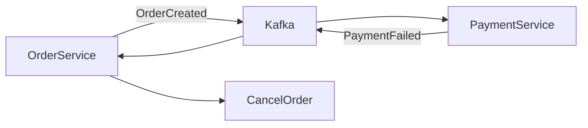

- [Fluxo Completo de Microsserviços](#fluxo-completo-de-microsserviços)
  - [Order → Payment → Inventory → Shipping](#order--payment--inventory--shipping)
- [1. Visão Geral do Fluxo](#1-visão-geral-do-fluxo)
- [2. Passo 1 — Criação do Pedido](#2-passo-1--criação-do-pedido)
- [3. Passo 2 — Processamento de Pagamento](#3-passo-2--processamento-de-pagamento)
- [4. Passo 3 — Reserva de Estoque](#4-passo-3--reserva-de-estoque)
- [5. Passo 4 — Envio do Pedido](#5-passo-4--envio-do-pedido)
- [6. Notificação ao Cliente](#6-notificação-ao-cliente)
- [7. Fluxo Completo (Sequência)](#7-fluxo-completo-sequência)
- [8. Cenário de Falha (Saga Compensation)](#8-cenário-de-falha-saga-compensation)
- [9. Estrutura de Tópicos Kafka](#9-estrutura-de-tópicos-kafka)
- [10. Benefícios da Arquitetura](#10-benefícios-da-arquitetura)
- [Conclusão](#conclusão)


# Fluxo Completo de Microsserviços
## Order → Payment → Inventory → Shipping

Este documento descreve um **fluxo completo de processamento de pedido em uma arquitetura de microsserviços orientada a eventos**.

Stack típica:

- Java + Spring Boot
- Apache Kafka
- PostgreSQL
- Kubernetes

Microsserviços envolvidos:

1. Order Service
2. Payment Service
3. Inventory Service
4. Shipping Service
5. Notification Service

---

# 1. Visão Geral do Fluxo



Fluxo de eventos:

1. OrderCreated
2. PaymentCompleted
3. InventoryReserved
4. OrderShipped

---

# 2. Passo 1 — Criação do Pedido

Cliente envia requisição.



Evento gerado:

```json
{
  "eventType": "OrderCreated",
  "orderId": "123",
  "customerId": "456",
  "total": 250
}
```

Consumidores:

- Payment Service
- Inventory Service

---

# 3. Passo 2 — Processamento de Pagamento

Payment Service consome evento.



Evento:

```json
{
  "eventType": "PaymentCompleted",
  "orderId": "123",
  "paymentId": "789"
}
```

---

# 4. Passo 3 — Reserva de Estoque

Inventory Service reage ao evento.



Evento:

```json
{
  "eventType": "InventoryReserved",
  "orderId": "123",
  "items": 3
}
```

---

# 5. Passo 4 — Envio do Pedido

Shipping Service cria envio.



Evento:

```json
{
  "eventType": "OrderShipped",
  "orderId": "123",
  "trackingCode": "TRACK-999"
}
```

---

# 6. Notificação ao Cliente

Notification Service consome evento.



Exemplos de notificações:

- email
- push notification
- SMS

---

# 7. Fluxo Completo (Sequência)



---

# 8. Cenário de Falha (Saga Compensation)

Se pagamento falhar:



Evento:

```json
{
  "eventType": "PaymentFailed",
  "orderId": "123"
}
```

Ação:

- cancelar pedido
- liberar estoque

---

# 9. Estrutura de Tópicos Kafka

Exemplo de tópicos:

| Topic | Producer | Consumers |
|------|----------|-----------|
orders | Order Service | Payment |
payments | Payment Service | Inventory |
inventory | Inventory Service | Shipping |
shipping | Shipping Service | Notification |

---

# 10. Benefícios da Arquitetura

- baixo acoplamento
- alta escalabilidade
- processamento assíncrono
- resiliência a falhas
- fácil evolução

---

# Conclusão

Este fluxo representa um **pipeline completo de processamento de pedidos em microsserviços orientados a eventos**.

Esse padrão é utilizado em arquiteturas modernas de:

- e-commerce
- fintech
- marketplaces
- plataformas SaaS
