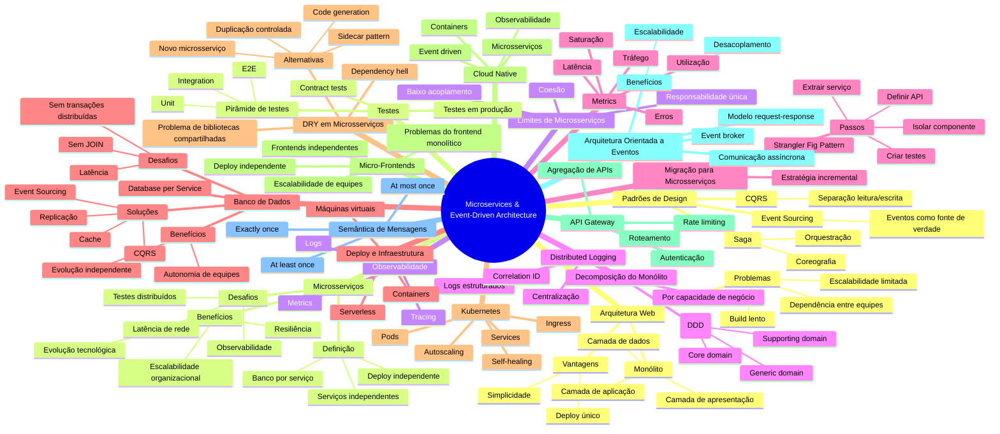

# Mapa Mental — The Complete Microservices & Event-Driven Architecture

Este mapa mental resume **todo o conteúdo do documento** usando um diagrama Mermaid.

```mermaid
mindmap
  root((Microservices & Event‑Driven Architecture))

    Arquitetura Web
      Monólito
        Camada de apresentação
        Camada de aplicação
        Camada de dados
      Vantagens
        Simplicidade
        Deploy único
      Problemas
        Escalabilidade limitada
        Build lento
        Dependência entre equipes

    Microsserviços
      Definição
        Serviços independentes
        Deploy independente
        Banco por serviço
      Benefícios
        Escalabilidade organizacional
        Resiliência
        Evolução tecnológica
      Desafios
        Latência de rede
        Observabilidade
        Testes distribuídos

    Limites de Microsserviços
      Coesão
      Responsabilidade única
      Baixo acoplamento

    Decomposição do Monólito
      Por capacidade de negócio
      Por subdomínio (DDD)
        Core domain
        Supporting domain
        Generic domain

    Migração para Microsserviços
      Estratégia incremental
      Strangler Fig Pattern
      Passos
        Criar testes
        Definir API
        Isolar componente
        Extrair serviço

    Banco de Dados
      Database per Service
      Benefícios
        Autonomia de equipes
        Evolução independente
      Desafios
        Latência
        Sem JOIN
        Sem transações distribuídas
      Soluções
        Cache
        Replicação
        CQRS
        Event Sourcing

    DRY em Microsserviços
      Problema de bibliotecas compartilhadas
      Dependency hell
      Alternativas
        Novo microsserviço
        Code generation
        Duplicação controlada
        Sidecar pattern

    Micro‑Frontends
      Problemas do frontend monolítico
      Frontends independentes
      Deploy independente
      Escalabilidade de equipes

    API Gateway
      Autenticação
      Rate limiting
      Roteamento
      Agregação de APIs

    Arquitetura Orientada a Eventos
      Modelo request‑response
      Comunicação assíncrona
      Event broker
      Benefícios
        Desacoplamento
        Escalabilidade

    Semântica de Mensagens
      At most once
      At least once
      Exactly once

    Padrões de Design
      Saga
        Orquestração
        Coreografia
      CQRS
        Separação leitura/escrita
      Event Sourcing
        Eventos como fonte de verdade

    Testes
      Pirâmide de testes
        Unit
        Integration
        E2E
      Contract tests
      Testes em produção

    Observabilidade
      Logs
      Metrics
      Tracing

    Distributed Logging
      Logs estruturados
      Centralização
      Correlation ID

    Metrics
      Tráfego
      Erros
      Latência
      Saturação
      Utilização

    Deploy e Infraestrutura
      Máquinas virtuais
      Serverless
      Containers

    Kubernetes
      Pods
      Services
      Ingress
      Autoscaling
      Self‑healing

    Cloud Native
      Microsserviços
      Event driven
      Containers
      Observabilidade
```
