- [Guia Visual — Microservices \& Event‑Driven Architecture](#guia-visual--microservices--eventdriven-architecture)
- [1. Arquitetura Web Monolítica](#1-arquitetura-web-monolítica)
- [2. Arquitetura de Microsserviços](#2-arquitetura-de-microsserviços)
- [3. Comunicação entre Microsserviços](#3-comunicação-entre-microsserviços)
  - [Comunicação Síncrona](#comunicação-síncrona)
- [4. Arquitetura Orientada a Eventos](#4-arquitetura-orientada-a-eventos)
- [5. Database per Service](#5-database-per-service)
- [6. Saga Pattern (Transações Distribuídas)](#6-saga-pattern-transações-distribuídas)
  - [Saga Coreografada](#saga-coreografada)
  - [Saga Orquestrada](#saga-orquestrada)
- [7. CQRS](#7-cqrs)
- [8. Event Sourcing](#8-event-sourcing)
- [9. Observabilidade](#9-observabilidade)
- [10. Arquitetura Kubernetes para Microsserviços](#10-arquitetura-kubernetes-para-microsserviços)
- [11. Arquitetura Cloud Native Completa](#11-arquitetura-cloud-native-completa)
- [Conclusão](#conclusão)

# Guia Visual — Microservices & Event‑Driven Architecture

Este material apresenta os conceitos do documento **The Complete Microservices & Event‑Driven Architecture**
com **diagramas de arquitetura usando Mermaid** para facilitar o estudo.

---

# 1. Arquitetura Web Monolítica

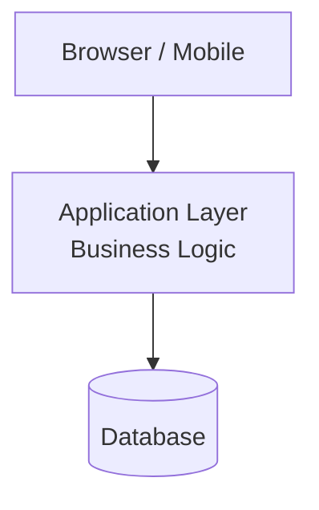
```mermaid
flowchart TD
    Client[Browser / Mobile]
    App[Application Layer<br>Business Logic]
    DB[(Database)]

    Client --> App
    App --> DB
```

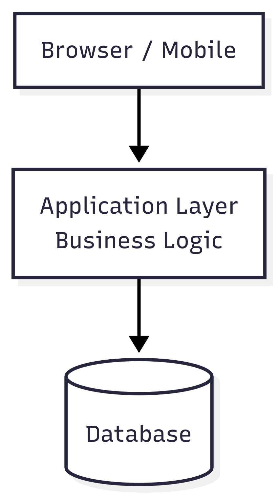

Características:

- aplicação única
- deploy único
- banco centralizado

Vantagens:
- simplicidade
- baixo custo operacional inicial

Problemas ao escalar:
- deploy arriscado
- build lento
- dependência entre equipes

---

# 2. Arquitetura de Microsserviços

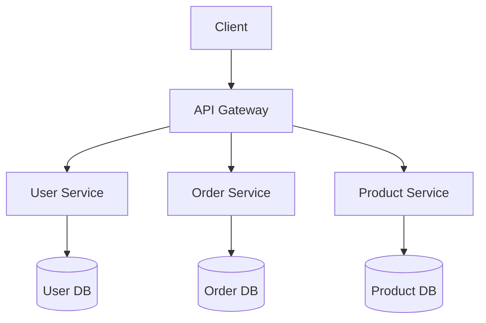
```mermaid
flowchart TD
    Client
    Gateway[API Gateway]

    UserSvc[User Service]
    OrderSvc[Order Service]
    ProductSvc[Product Service]

    UserDB[(User DB)]
    OrderDB[(Order DB)]
    ProductDB[(Product DB)]

    Client --> Gateway

    Gateway --> UserSvc
    Gateway --> OrderSvc
    Gateway --> ProductSvc

    UserSvc --> UserDB
    OrderSvc --> OrderDB
    ProductSvc --> ProductDB
```

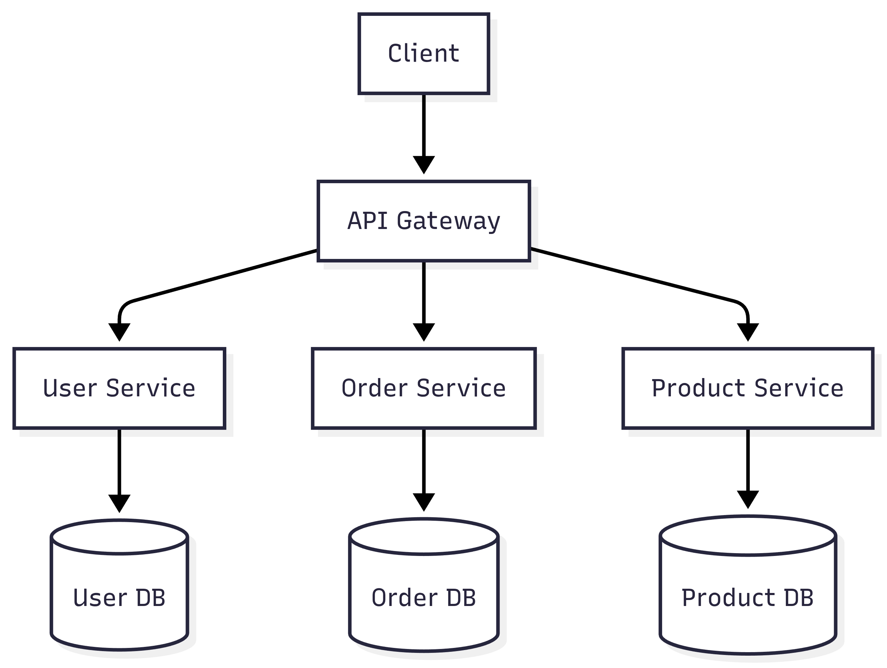

Características:

- serviços independentes
- deploy independente
- banco por serviço
- escalabilidade isolada

---

# 3. Comunicação entre Microsserviços

## Comunicação Síncrona

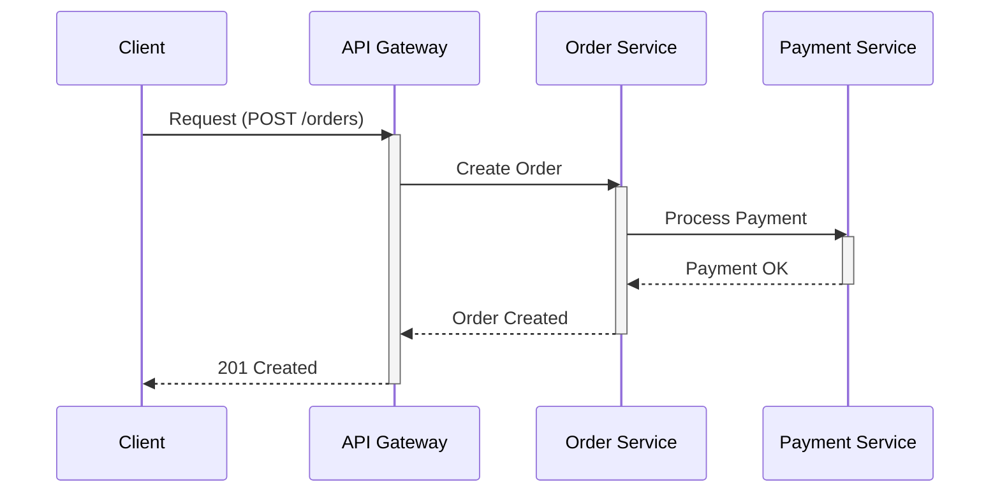
```mermaid
sequenceDiagram
    participant C as Client
    participant G as API Gateway
    participant O as Order Service
    participant P as Payment Service

    C->>G: Request (POST /orders)
    activate G
    G->>O: Create Order
    activate O
    O->>P: Process Payment
    activate P
    P-->>O: Payment OK
    deactivate P
    O-->>G: Order Created
    deactivate O
    G-->>C: 201 Created
    deactivate G
```
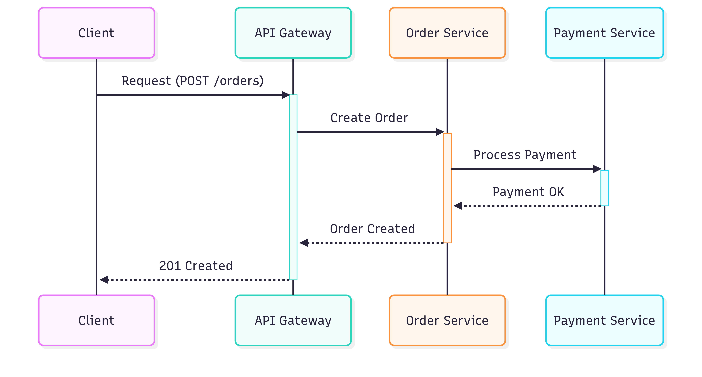
Problemas:

- latência
- acoplamento
- cascading failure

---

# 4. Arquitetura Orientada a Eventos

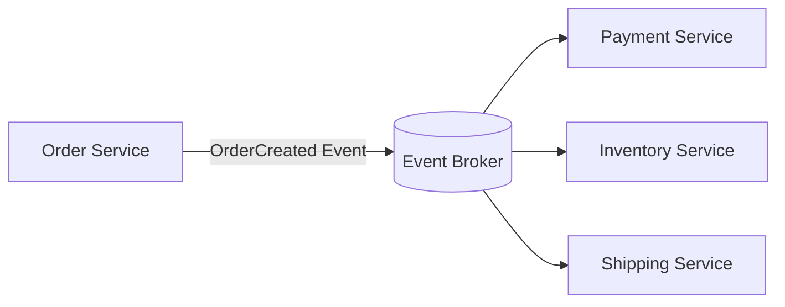
```mermaid
flowchart LR

    OrderSvc[Order Service]
    Kafka[(Event Broker)]

    PaymentSvc[Payment Service]
    InventorySvc[Inventory Service]
    ShippingSvc[Shipping Service]

    OrderSvc -->|OrderCreated Event| Kafka

    Kafka --> PaymentSvc
    Kafka --> InventorySvc
    Kafka --> ShippingSvc
```

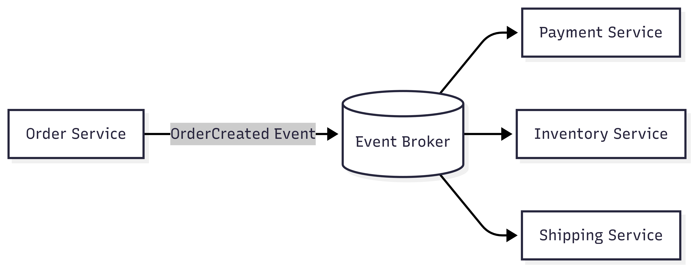

Benefícios:

- desacoplamento
- escalabilidade
- comunicação assíncrona

---

# 5. Database per Service

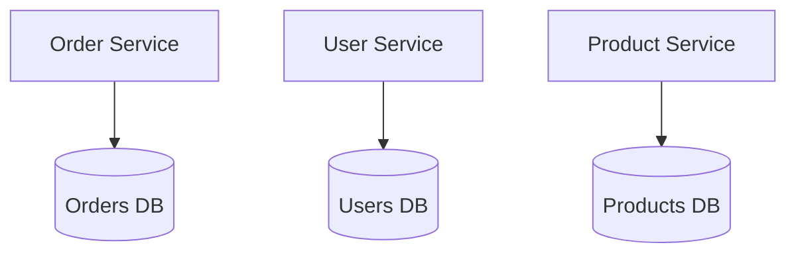
```mermaid
flowchart TD

    OrderSvc[Order Service]
    OrderDB[(Orders DB)]

    UserSvc[User Service]
    UserDB[(Users DB)]

    ProductSvc[Product Service]
    ProductDB[(Products DB)]

    OrderSvc --> OrderDB
    UserSvc --> UserDB
    ProductSvc --> ProductDB
```

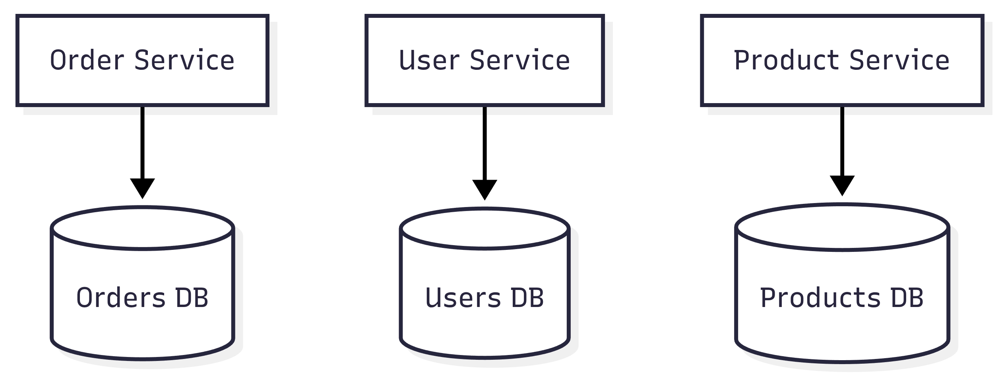

Regra fundamental:

**cada microsserviço possui seu próprio banco de dados**.

---

# 6. Saga Pattern (Transações Distribuídas)

## Saga Coreografada

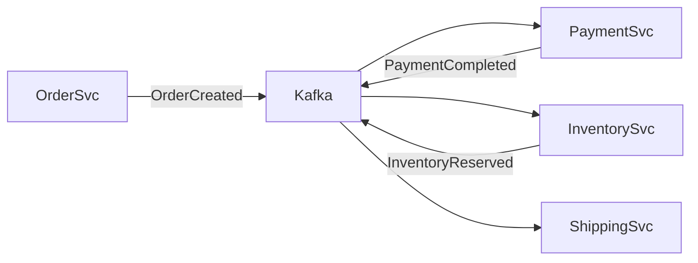
```mermaid
flowchart LR

    OrderSvc -->|OrderCreated| Kafka
    Kafka --> PaymentSvc
    PaymentSvc -->|PaymentCompleted| Kafka
    Kafka --> InventorySvc
    InventorySvc -->|InventoryReserved| Kafka
    Kafka --> ShippingSvc
```

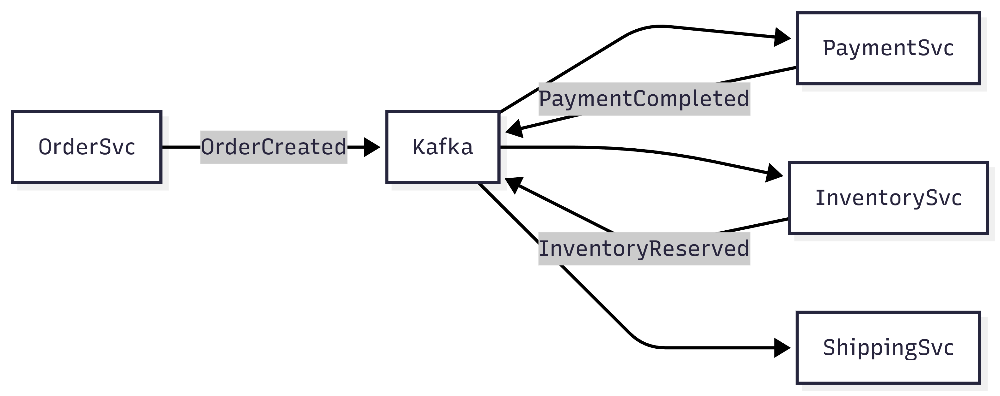

Cada serviço reage a eventos.

---

## Saga Orquestrada

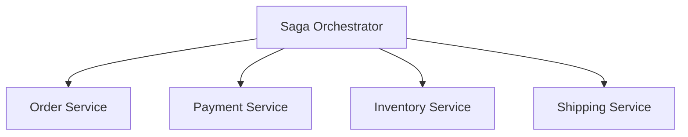
```mermaid
flowchart TD

    Orchestrator[Saga Orchestrator]

    OrderSvc[Order Service]
    PaymentSvc[Payment Service]
    InventorySvc[Inventory Service]
    ShippingSvc[Shipping Service]

    Orchestrator --> OrderSvc
    Orchestrator --> PaymentSvc
    Orchestrator --> InventorySvc
    Orchestrator --> ShippingSvc
```

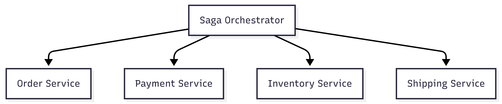

Orquestrador controla o fluxo.

---

# 7. CQRS

Separação entre leitura e escrita.

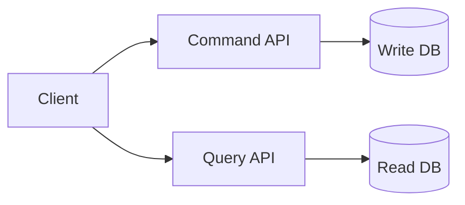
```mermaid
flowchart LR

    Client --> CommandAPI[Command API]
    CommandAPI --> WriteDB[(Write DB)]

    Client --> QueryAPI[Query API]
    QueryAPI --> ReadDB[(Read DB)]
```

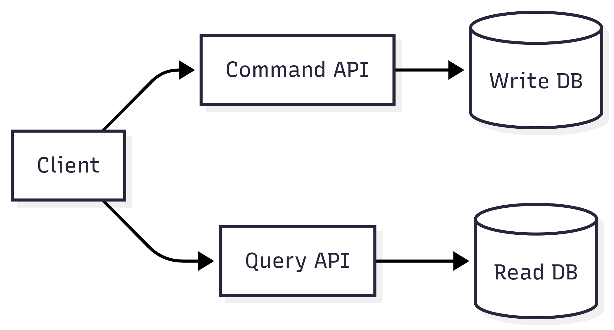

Benefícios:

- leitura otimizada
- escalabilidade

---

# 8. Event Sourcing

Estado armazenado como eventos.

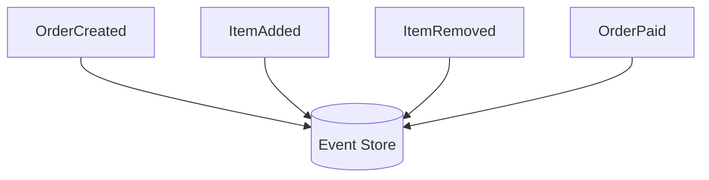
```mermaid
flowchart TD

    EventStore[(Event Store)]

    Event1[OrderCreated]
    Event2[ItemAdded]
    Event3[ItemRemoved]
    Event4[OrderPaid]

    Event1 --> EventStore
    Event2 --> EventStore
    Event3 --> EventStore
    Event4 --> EventStore
```

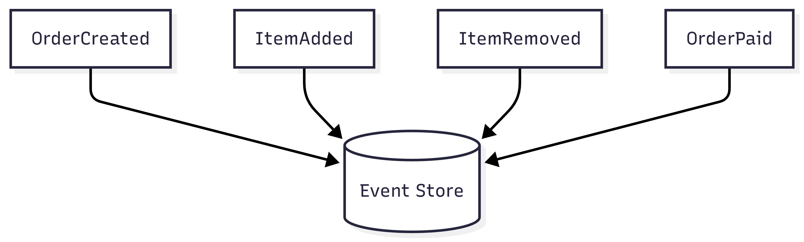

O estado do sistema pode ser reconstruído reproduzindo eventos.

---

# 9. Observabilidade

Três pilares:

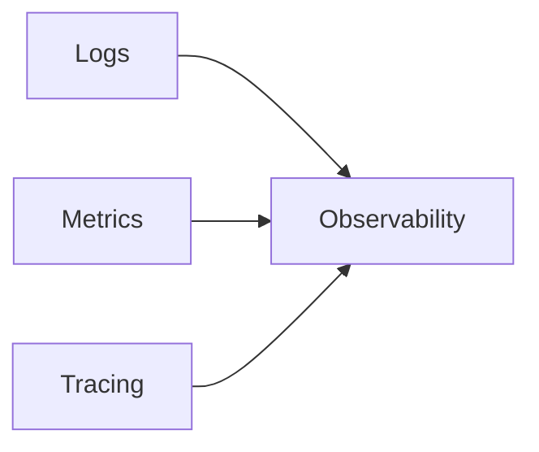
```mermaid
flowchart LR

Logs --> Observability
Metrics --> Observability
Tracing --> Observability
```

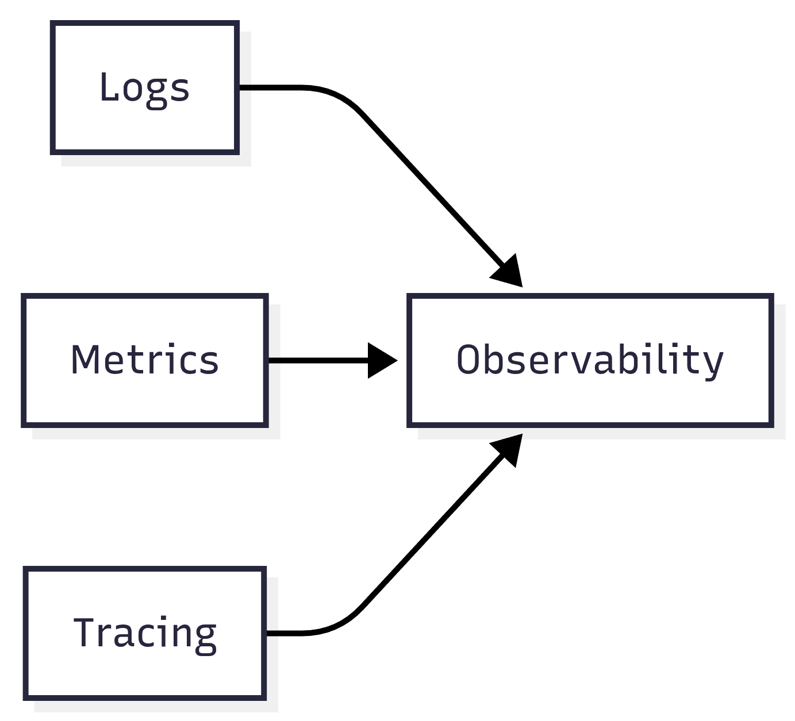

Ferramentas comuns:

- OpenTelemetry
- Prometheus
- Grafana
- ELK
- Jaeger

---

# 10. Arquitetura Kubernetes para Microsserviços

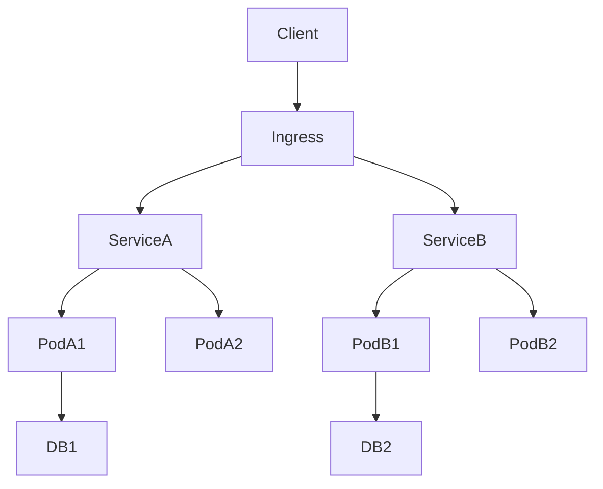
```mermaid
flowchart TD

    Client --> Ingress

    Ingress --> ServiceA
    Ingress --> ServiceB

    ServiceA --> PodA1
    ServiceA --> PodA2

    ServiceB --> PodB1
    ServiceB --> PodB2

    PodA1 --> DB1
    PodB1 --> DB2
```
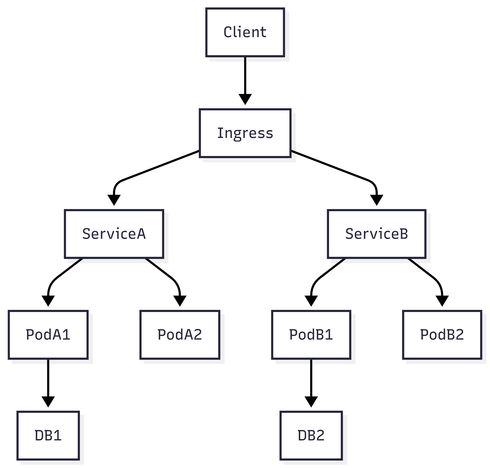

Kubernetes fornece:

- autoscaling
- self healing
- service discovery

---

# 11. Arquitetura Cloud Native Completa

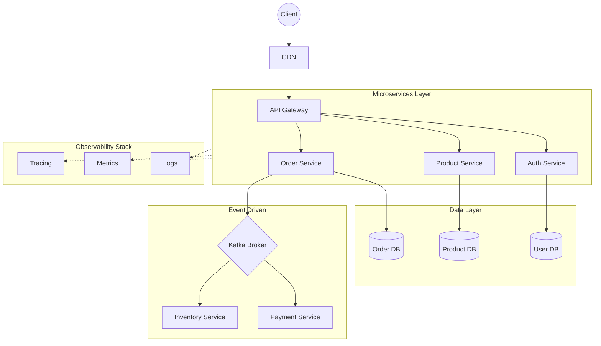
```mermaid
flowchart TD
    Client((Client)) --> CDN[CDN]
    CDN --> GW[API Gateway]

    subgraph Services [Microservices Layer]
        GW --> AuthSvc[Auth Service]
        GW --> ProductSvc[Product Service]
        GW --> OrderSvc[Order Service]
    end

    subgraph Storage [Data Layer]
        AuthSvc --> UserDB[(User DB)]
        ProductSvc --> ProductDB[(Product DB)]
        OrderSvc --> OrderDB[(Order DB)]
    end

    subgraph Messaging [Event Driven]
        OrderSvc --> Kafka{Kafka Broker}
        Kafka --> PaymentSvc[Payment Service]
        Kafka --> InventorySvc[Inventory Service]
    end

    %% Conectando a Observabilidade (Exemplo de fluxo de telemetria)
    Services -.-> Logs
    Services -.-> Metrics
    Services -.-> Tracing

    subgraph Observability [Observability Stack]
        Logs
        Metrics
        Tracing
    end
```

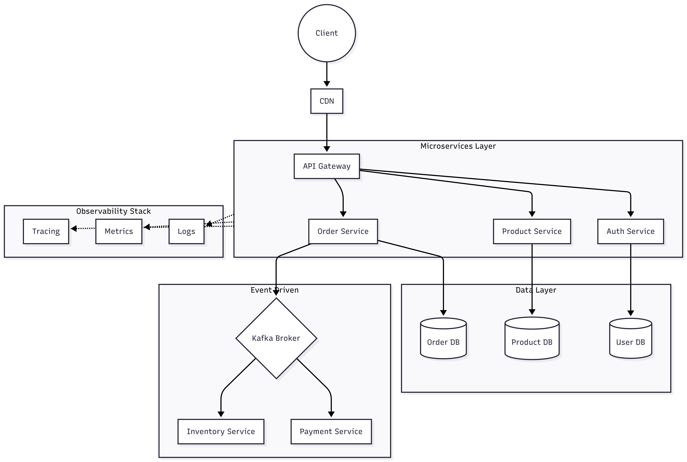

Essa é uma arquitetura típica usada em sistemas modernos escaláveis.

---

# Conclusão

Arquiteturas modernas combinam:

- Microservices
- Event‑Driven Architecture
- Cloud Native Infrastructure

Principais princípios:

- baixo acoplamento
- responsabilidade única
- banco por serviço
- comunicação assíncrona
- observabilidade completa
